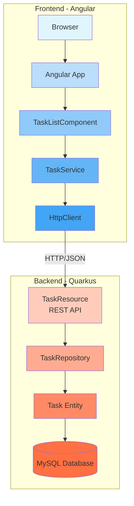
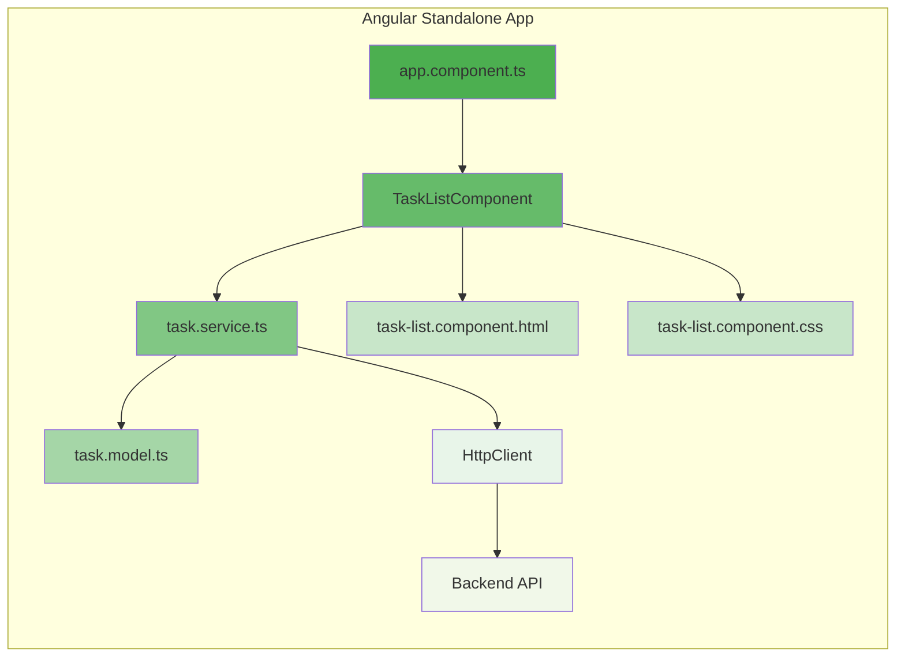
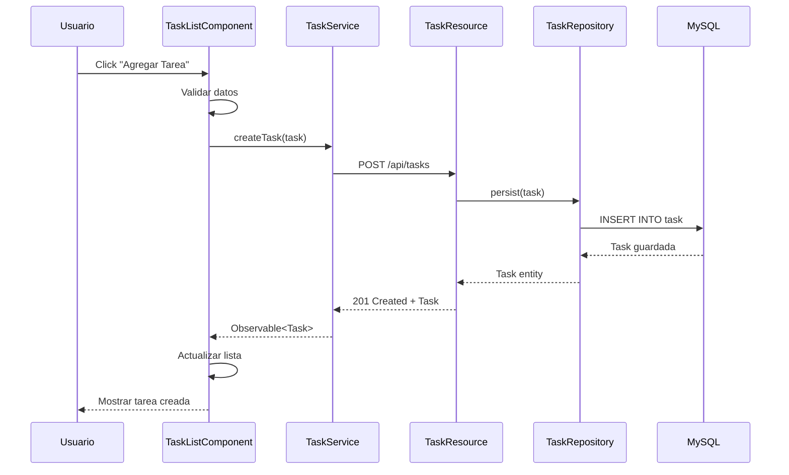
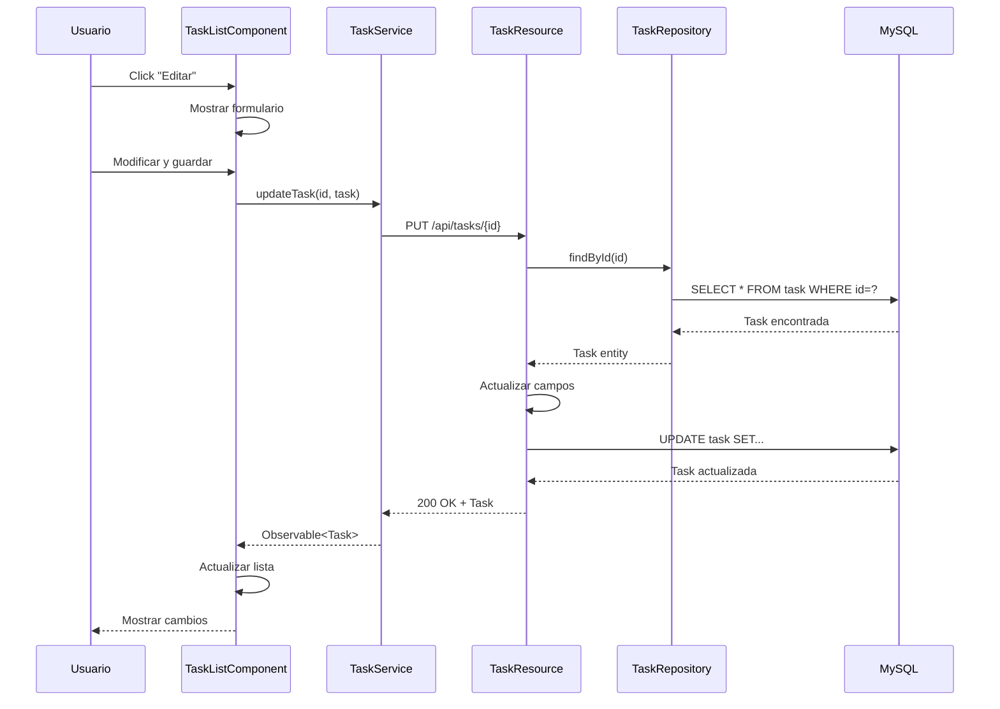

# Arquitectura del Sistema - Todo List

## Diagrama de Arquitectura General



## Diagrama de Componentes Frontend



## Diagrama de Capas Backend

```mermaid
graph TB
    subgraph "Presentation Layer"
        A[TaskResource<br/>@Path /api/tasks]
    end
    
    subgraph "Business Layer"
        B[TaskRepository<br/>PanacheRepository]
    end
    
    subgraph "Data Layer"
        C[Task Entity<br/>@Entity]
        D[(MySQL<br/>todo_db)]
    end
    
    A -->|Inject| B
    B -->|Persist/Query| C
    C -->|Hibernate ORM| D
    
    style A fill:#ff9800
    style B fill:#ffa726
    style C fill:#ffb74d
    style D fill:#ffcc80
```

## Diagrama de Flujo - Crear Tarea



## Diagrama de Flujo - Actualizar Tarea



## Estructura de Directorios

### Backend (Quarkus)
```
backend/
├── src/
│   └── main/
│       ├── java/com/kiro/
│       │   ├── entity/
│       │   │   └── Task.java
│       │   ├── repository/
│       │   │   └── TaskRepository.java
│       │   └── resource/
│       │       └── TaskResource.java
│       └── resources/
│           └── application.properties
├── pom.xml
└── .mvn/
    └── settings.xml
```

### Frontend (Angular)
```
frontend/
├── src/
│   ├── app/
│   │   ├── components/
│   │   │   └── task-list/
│   │   │       ├── task-list.component.ts
│   │   │       ├── task-list.component.html
│   │   │       └── task-list.component.css
│   │   ├── models/
│   │   │   └── task.model.ts
│   │   ├── services/
│   │   │   └── task.service.ts
│   │   ├── app.component.ts
│   │   └── app.config.ts
│   ├── index.html
│   └── main.ts
├── angular.json
├── package.json
└── tsconfig.json
```

## Tecnologías Utilizadas

### Frontend
- **Framework:** Angular 18 (Standalone Components)
- **HTTP Client:** Angular HttpClient
- **Estilos:** CSS puro
- **Build:** Angular CLI + Vite

### Backend
- **Framework:** Quarkus 3.6.4
- **Java:** 17
- **ORM:** Hibernate Panache
- **API:** JAX-RS (RESTEasy Reactive)
- **Documentación:** OpenAPI/Swagger
- **Base de Datos:** MySQL 8.x

### Comunicación
- **Protocolo:** HTTP/REST
- **Formato:** JSON
- **CORS:** Habilitado para localhost:4200

## Endpoints API

| Método | Endpoint | Descripción |
|--------|----------|-------------|
| GET | `/api/tasks` | Listar todas las tareas |
| GET | `/api/tasks/{id}` | Obtener tarea por ID |
| POST | `/api/tasks` | Crear nueva tarea |
| PUT | `/api/tasks/{id}` | Actualizar tarea |
| DELETE | `/api/tasks/{id}` | Eliminar tarea |
| GET | `/api/tasks/completed/{status}` | Filtrar por estado |

## Acceso a Swagger UI

Una vez que el backend esté corriendo, puedes acceder a la documentación interactiva en:

**URL:** http://localhost:8080/swagger-ui

Desde ahí podrás:
- Ver todos los endpoints disponibles
- Probar las APIs directamente
- Ver los modelos de datos
- Descargar la especificación OpenAPI
